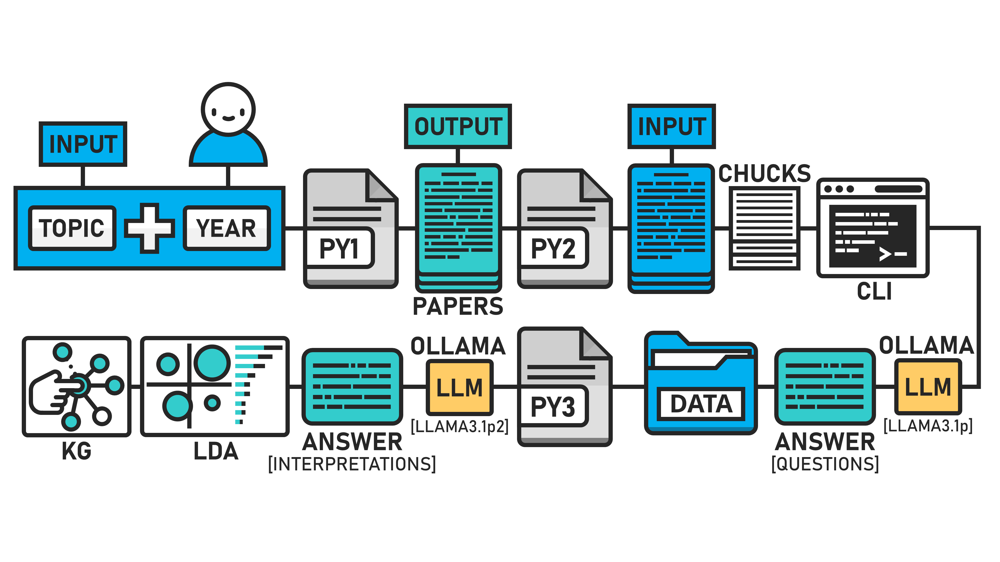

# FACTS V2 APP
## Filtering and Analysis of Content in Textual Sources

This repository, developed by Stefan Pietrusky, is based on the article published at Towards Data Science [[1]](https://medium.com/@stefanpietrusky/facts-v2-filtering-and-analysis-of-content-in-textual-sources-1a16cdac811b). In this article, I describe the functionality of an enhanced version (V2) of the FACTS application. The first version has already been tested and provided important results for improvement. The testing of the first version of FACTS provides concrete insights into the future of education in the age of AI [[2]](https://arxiv.org/abs/2412.07794). 

The adapted (V1.5) version of the application was successfully tested during the 6th IGSP Congress. The results of this test are yet to be published. The current version (V2) has been further improved and adapted so that the entire process can now be controlled via a common interface. This is an open source project for educational and research purposes.

## FACTS Structure
The illustration shows the functional principle of the FACTS (V1.5) app. Three separate Python scripts had to be executed for a complete run.



## FACTS working principle
Below is a short GIF showing the structure and function of the app.


## FACTS availability
The code to run the app is already in the repository.The code is available in both German (GER) and English.

## Installing and running the application 
1. Clone this repository on your local computer: 
```bash 
git clone https://github.com/stefanpietrusky/factsv2.git
```
2. Install the required dependencies:
```bash 
pip install -r requirements.txt
```
3. Install Ollama and load the model [Llama3.1](https://ollama.com/library/llama3.1) (8B). Alternatively, another model can be used but you need to adapt the code (parsing/regex).
4. Install Python [3.10.11](https://www.python.org/downloads/release/python-31011/).
5. Download a suitable web driver. For example, the [GeckoDriver](https://github.com/mozilla/geckodriver/releases). Adjust the constant GECKO_DRIVER_PATH accordingly.
6. Create the specific versions of the LLM models with the following command
```bash 
ollama create llama3.1p -f PATH\modelfile.txt
ollama create llama3.1p2 -f PATH\modelfile.txt
```
7. Start the FACTS app:
```bash 
python app.py
```
## References
[1] Pietrusky, S. (2025). FACTS V2: Filtering and Analysis of Content in Textual Sources. New ways to automatically answer scientific questions based on evidence. Towards Data Science

[2] Pietrusky, S. (2024). Automatic answering of scientific questions using the FACTS-V1 framework: New methods in research to increase efficiency through the use of generative AI. ARXIV CS.DL 
