# FACTS V2.5 APP
## Filtering and Analysis of Content in Textual Sources

This repository, developed by Stefan Pietrusky, is based on the article published at Data Science Collective [[1]](https://medium.com/@stefanpietrusky/facts-v2-filtering-and-analysis-of-content-in-textual-sources-1a16cdac811b). In this article, I describe the functionality of an enhanced version (V2) of the FACTS application. The first version has already been tested and provided important results for improvement. The testing of the first version of FACTS provides concrete insights into the future of education in the age of AI [[2]](https://arxiv.org/abs/2412.07794). 

The adapted (V1.5) version of the application was successfully tested during the 6th IGSP Congress. The results of this test are available at peDOCS and show that FACTS provides answers to the questions posed by the congress [[3]](https://www.pedocs.de/frontdoor.php?source_opus=33063). The version (V2) has been further improved and adapted so that the entire process can now be controlled via a common interface. 

In the current version (V2.5), the search function for articles has been revised. Since the structure of ERIC has changed, a number of changes have been made here. The methods used by the other databases have also been adapted. The design has been modified and processes that have been started can now be terminated. In future, additional databases and new evaluation options are to be integrated. This is an open source project for educational and research purposes.

> **⚠️ Work in Progress:** This prototyp is currently under active development. While I make it available for research purposes, please be aware that there will be some changes to the functional structure. I recognize that some current technical design decisions may not be optimal and are subject to revision. Researchers using this prototyp should expect potential updates and changes. I recommend checking back regularly for updates and versioning information.

## FACTS Structure
The structure of the current [V2.5] FACTS app is shown below. 



## FACTS working principle
Below is a short GIF showing the structure and function of the app.


## FACTS availability
The code to run the app is already in the repository.The code is available in both German (GER) and English.

## Installing and running the application 
1. Clone this repository on your local computer: 
```bash 
git clone https://github.com/stefanpietrusky/factsv2.git
```
2. Install the required dependencies:
```bash 
pip install -r requirements.txt
```
3. Install Ollama and load the model [Llama3.1](https://ollama.com/library/llama3.1) (8B). Alternatively, another model can be used but you need to adapt the code (parsing/regex).
4. Install Python [3.10.11](https://www.python.org/downloads/release/python-31011/).
5. Download a suitable web driver. For example, the [GeckoDriver](https://github.com/mozilla/geckodriver/releases). Adjust the constant GECKO_DRIVER_PATH accordingly.
6. Create the specific versions of the LLM models with the following command
```bash 
ollama create llama3.1p -f PATH\modelfile.txt
```
7. Start the FACTS app:
```bash 
python app.py
```
## References
[1] Pietrusky, S. (2025). How I automatically find numerous answers for any given question. FACTS V2: Filtering and Analysis of Content in Textual Sources. Data Science Collective. Data Science Collective

[2] Pietrusky, S. (2024). Automatic answering of scientific questions using the FACTS-V1 framework: New methods in research to increase efficiency through the use of generative AI. ARXIV CS.DL 

[3] Pietrusky, S (2025). Changing school practice. Can artificial intelligence help provide answers to educational research questions? 6. IGSP Congress. peDOCS
